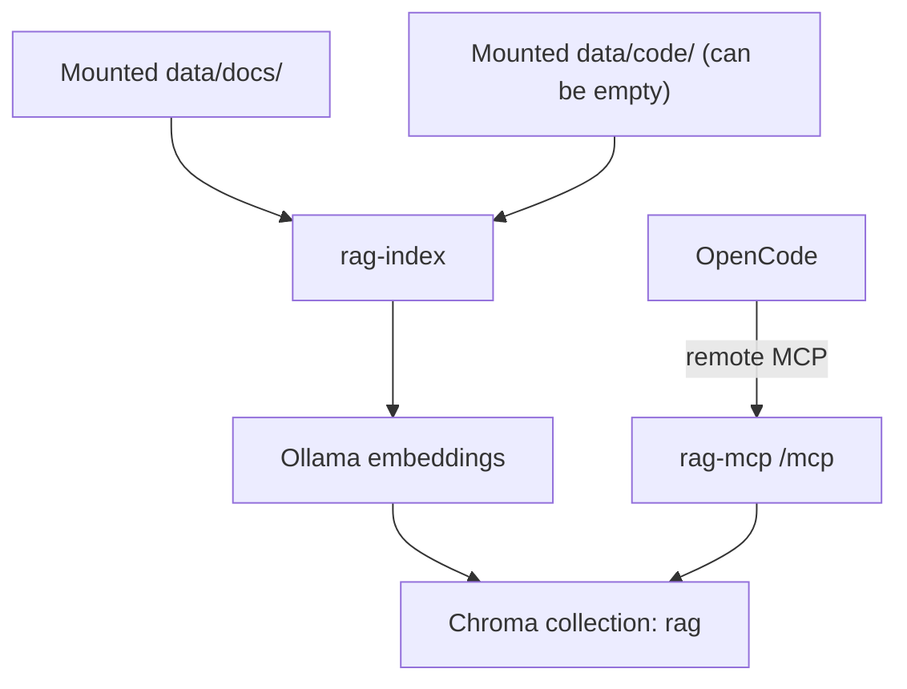

# rag-search-mcp (Go + Chroma + Ollama)

## Overview

`rag-search-mcp` is a Go-based MCP service for semantic retrieval across documentation and code. OpenCode connects through remote MCP (`type: "remote"`), and the runtime stays decoupled from the client. Project knowledge is usually split between docs, source code, and tribal context; keyword search misses intent, and manual navigation is slow during onboarding, debugging, and architecture work. This service indexes docs and code into a shared semantic store and exposes MCP tools to query both with one interface. Embeddings are generated via Ollama, chunks are stored in Chroma, and OpenCode can search by meaning instead of exact terms.

## Key Features

- Semantic retrieval across docs and code with one MCP interface
- Scope-aware search (`all`, `docs`, `code`) for targeted results
- Docker-first runtime with host-mounted sources and persistent index/model data
- Remote MCP integration for OpenCode via a single HTTP endpoint (`/mcp`)
- Operational make targets for install, reindex, diagnostics, and verification

## Architecture



Security and operating boundary for v1 is defined in `docs/architecture/THREAT_MODEL.md`.

## Installation & Quickstart

```bash
make install
```

`make install` bootstraps local config, prepares runtime data paths, starts the stack, pulls the embedding model, rebuilds the index, and verifies indexed data.

### Zielstruktur (Docker-first, alongside)

Empfohlene Zielstruktur fuer den Betrieb mit Host-Mounts:

```text
<parent>/
  main/
    docs/
    code/
    rag-search-mcp/
```

- `main/rag-search-mcp` enthaelt dieses Repository.
- `main/docs` wird als Dokumentationsquelle gemountet.
- `main/code` wird als Codequelle gemountet.

Fuer eine alongside-Installation (`<parent>/main/{docs,code,rag-search-mcp}`) starte `make install` in `main/rag-search-mcp` und setze die Host-Mounts auf die Nachbarordner, z. B.:

```bash
HOST_DOCS_DIR=../docs HOST_CODE_DIR=../code make install
```

Persistente Runtime-Daten bleiben auf dem Host in `main/rag-search-mcp/data` (oder in explizit gesetzten `HOST_INDEX_DIR`/`HOST_MODELS_DIR`).

Danach kann Reindex wie gewohnt in `main/rag-search-mcp` ausgefuehrt werden.

Reindex after changing mounted docs/code:

```bash
make reindex
```

## Example prompts

This repository ships app configuration and skills/tooling so these prompts work directly in OpenCode.

- `Use rag_search with scope docs to explain installation.`
- `Use rag_search with scope code to find chunking logic.`
- `Use rag_search with scope all and summarize architecture from docs and code.`
- `Call rag_list_sources with scope all.`

## Exposed MCP Tools

With the default MCP alias `rag-search-mcp` in `opencode.json`, OpenCode gets:

- `rag_search`: semantic search with `scope=all|docs|code` (default `all`)
- `rag_get_chunk`: fetch one chunk by `chunk_id`
- `rag_list_sources`: list indexed source paths
- `rag_reindex`: rebuild index from mounted sources

Scope behavior:

- `all` searches docs and code
- `docs` searches docs only
- `code` searches code only
- If `data/code` is empty or code ingest is disabled, `all` behaves like docs-only

## Make Targets

| Target | Purpose |
|---|---|
| `make install` | Bootstrap config, start runtime stack, pull model, reindex, verify data |
| `make clean-install` | Reinstall stack from scratch; preserves data by default, wipes index/models only with `FULL_RESET=1` |
| `make up` | Start runtime stack in detached mode |
| `make down` | Controlled runtime shutdown without container removal |
| `make test` | Run Go tests via the Dockerfile `go-runner` stage |
| `make reindex` | Rebuild semantic index in the running `rag-mcp` container |
| `make logs` | Stream runtime logs |
| `make doctor` | Runtime checks for running stack (compose config, reindex, index verify, health) |

Interactive installer behavior:

- `make install` prompts in interactive terminals with three options: keep current source paths (default), use standard `./data/docs` + `./data/code`, or enter custom paths.
- Pressing Enter keeps the currently resolved values (from explicit `HOST_DOCS_DIR` / `HOST_CODE_DIR`, then `.env`, then defaults).
- The selected source paths are written to `.env` on the host before Docker starts.
- Make targets remain the user-facing API; host-side shell helpers under `shell/` are internal implementation details.

Lifecycle examples:

```bash
make down
make clean-install
make clean-install FULL_RESET=1
```

Warning: `make clean-install FULL_RESET=1` permanently deletes the host directories resolved from `HOST_INDEX_DIR` and `HOST_MODELS_DIR` before reinstalling.

All Go toolchain commands in local workflows and CI shell helpers run in containers, so a local Go installation is not required for normal development flow.
The Dockerfile is the canonical Go toolchain image source; shell helpers build and run the shared `go-runner` stage.

Docker-only Guardrails:

- Standard local workflows use `make` targets only; direct local `go` execution is intentionally avoided.
- CI workflows execute quality/security checks via dedicated shell scripts under `shell/` or direct Docker long commands.
- `make test` and the CI coverage gate use the same Dockerfile-based `go-runner` path (`shell/go-runner.sh`).

## Troubleshooting & Diagnose

Validate runtime configuration:

```bash
docker compose --project-directory . -f docker/docker-compose.yml config
```

Check service state:

```bash
docker compose --project-directory . -f docker/docker-compose.yml ps
```

Inspect runtime logs:

```bash
docker compose --project-directory . -f docker/docker-compose.yml logs rag-mcp
docker compose --project-directory . -f docker/docker-compose.yml logs chroma
docker compose --project-directory . -f docker/docker-compose.yml logs ollama
```

Run end-to-end health and index checks:

```bash
make doctor
```

`make reindex` and the reindex/index-verify steps inside `make doctor` execute in the running `rag-mcp` container via `docker compose exec -T`.
If the stack is not running, both commands fail fast with a deterministic error.

Run index verification only:

```bash
sh ./shell/doctor-verify-index.sh
```

## Configuration

### Security and operating boundary (v1)

- Default mode is `localhost-only`.
- `LAN-only` is an explicit opt-in mode and not enabled by default.
- `WAN/Internet` exposure and `VPN/Overlay` access are out of scope in v1.
- Non-loopback access requires additional controls as defined in `docs/architecture/RAG-SEARCH-MCP-ADR-2026-04-11-lan-betriebsmodus.md` and `docs/architecture/THREAT_MODEL.md`.

### Environment variables

| Variable | Default | Description |
|---|---|---|
| `RAG_HTTP_HOST` | `127.0.0.1` | HTTP bind address (local default is loopback) |
| `RAG_HTTP_PORT` | `8765` | MCP HTTP port on host |
| `HOST_DOCS_DIR` | `./data/docs` | Host path mounted as docs source |
| `HOST_CODE_DIR` | `./data/code` | Host path mounted as code source (can be empty) |
| `HOST_INDEX_DIR` | `./data/index` | Host path mounted for Chroma index persistence |
| `HOST_MODELS_DIR` | `./data/models` | Host path mounted for Ollama model persistence (`/root/.ollama/models`) |
| `RAG_ENABLE_CODE_INGEST` | `true` | Enable/disable code ingestion |
| `OLLAMA_HOST` | `http://ollama:11434` | Embedding endpoint for containerized runtime |
| `OLLAMA_PORT` | `11434` | Host port mapped to the Ollama container |
| `EMBED_MODEL` | `nomic-embed-text` | Embedding model name |
| `RAG_COLLECTION_NAME` | `rag` | Chroma collection name |
| `RAG_SCOPE_DEFAULT` | `all` | Default search scope |
| `RAG_CHUNK_SIZE` | `1200` | Chunk size in chars |
| `RAG_CHUNK_OVERLAP` | `200` | Chunk overlap in chars |
| `RAG_MAX_TOP_K` | `50` | Upper bound for search `top_k` |

### OpenCode configuration

`opencode.json` uses remote MCP:

```json
{
  "$schema": "https://opencode.ai/config.json",
  "mcp": {
    "rag-search-mcp": {
      "type": "remote",
      "url": "http://127.0.0.1:8765/mcp",
      "enabled": true,
      "timeout": 10000
    }
  }
}
```

This project is operated Docker-first. Use the provided container stack and `make` targets as the canonical runtime and maintenance workflow.

Note: `opencode.json` in this repository is local/machine-specific and ignored by git.

## Actions

GitHub Actions workflows:

- `ci-fast`: technical quality gates with separate required jobs: `fmt`, `vet`, `test`, `build`, `bootstrap-smoke`, `compose-validate` (plus non-required `docker-test-stage` to validate Dockerfile test target)
- `security-baseline`: gitleaks and `govulncheck`
- `integration-ollama`: full runtime startup via `make install` with health smoke check
- `supply-chain`: SBOM generation, license allowlist gate, filesystem/image vulnerability scans

Recommended required checks for branch protection:

- `fmt`
- `vet`
- `test`
- `build`
- `bootstrap-smoke`
- `compose-validate`

Local reproduction of the required checks:

- `sh ./shell/ci-fmt-check.sh`
- `sh ./shell/ci-vet.sh`
- `COVERAGE_MIN=60 sh ./shell/ci-test-cover.sh`
- `sh ./shell/ci-build.sh`
- `sh ./shell/bootstrap-smoke.sh`
- `docker compose --project-directory . -f docker/docker-compose.yml config`

Note: deterministic Golden-Query retrieval regression tests are tracked separately in `P0-008` and are not part of the `ci-fast` technical baseline gates.

Dependency automation:

- Dependabot updates for `gomod`, `github-actions`, and `docker` via `.github/dependabot.yml`

## Dependencies

Runtime dependencies:

- Docker Engine + Docker Compose plugin
- GNU Make

Service dependencies started by `make` targets:

- `ollama` for embedding generation
- `chroma` for vector storage
- `rag-mcp` for MCP HTTP endpoint

Artifacts and local resources managed during install:

- `.env` is created from `.env.example` if missing
- `opencode.json` is upserted with remote MCP config (default alias: `rag-search-mcp`)
- Host paths are ensured with precedence `Process Env > .env > defaults` (`HOST_DOCS_DIR`, `HOST_CODE_DIR`, `HOST_INDEX_DIR`, `HOST_MODELS_DIR`)
- Embedding model `${EMBED_MODEL:-nomic-embed-text}` is pulled into Ollama
