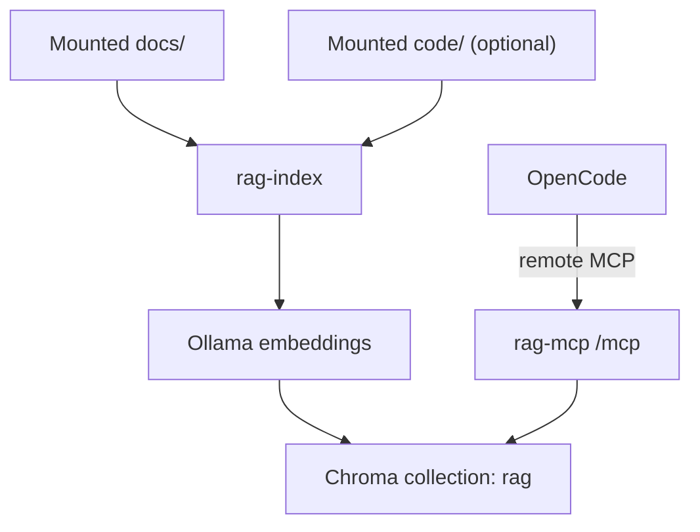

# RAG MCP Service (Go + Chroma + Ollama)

This repository provides a Go-first MCP service named `rag` for semantic
retrieval over documentation and optional code.

- OpenCode connects via remote MCP (`type: "remote"`)
- Runtime can run local, in Docker, or elsewhere on the network/cloud
- One Docker Compose file configures docs and optional code through mounts
- Default query scope is `all`
- Local binary default bind is loopback (`127.0.0.1`) for safer defaults

## Architecture



## Tools exposed to OpenCode

If the MCP server is configured as `rag`, OpenCode sees these tools:

- `rag_search` - semantic search (`scope=all|docs|code`, default `all`)
- `rag_get_chunk` - fetch one chunk by `chunk_id`
- `rag_list_sources` - list indexed source paths
- `rag_reindex` - rebuild index from mounted sources

## Scope behavior

- `scope=all` (default): searches docs and optional code
- `scope=docs`: searches docs only
- `scope=code`: searches code only
- If no code is mounted/indexed, `scope=all` behaves like docs-only

## Docker Compose (single file)

`docker-compose.yml` is the only compose file.

- `HOST_DOCS_DIR` mount is required (defaults to `./docs`)
- `HOST_CODE_DIR` mount is optional (defaults to `./.empty-code`)
- Chroma persistence is managed by the `chroma_data` volume
- Compose sets `RAG_HTTP_HOST=0.0.0.0` inside container so host port publishing still works

### Start service

```bash
docker compose up -d --build
```

### Reindex mounted data

```bash
docker compose run --rm --entrypoint /app/rag-index rag-mcp
```

You can also trigger reindexing from OpenCode via `rag_reindex`.

### Stop service

```bash
docker compose down
```

## Environment variables

| Variable | Default | Description |
|---|---|---|
| `RAG_HTTP_HOST` | `127.0.0.1` | HTTP bind address (local default is loopback) |
| `RAG_HTTP_PORT` | `8080` | MCP HTTP port on host |
| `HOST_DOCS_DIR` | `./docs` | Host path mounted as docs source |
| `HOST_CODE_DIR` | `./.empty-code` | Host path mounted as optional code source |
| `RAG_ENABLE_CODE_INGEST` | `true` | Enable/disable code ingestion |
| `OLLAMA_HOST` | `http://host.docker.internal:11434` | Embedding endpoint |
| `EMBED_MODEL` | `nomic-embed-text` | Embedding model name |
| `RAG_COLLECTION_NAME` | `rag` | Chroma collection name |
| `RAG_SCOPE_DEFAULT` | `all` | Default search scope |
| `RAG_CHUNK_SIZE` | `1200` | Chunk size in chars |
| `RAG_CHUNK_OVERLAP` | `200` | Chunk overlap in chars |
| `RAG_MAX_TOP_K` | `50` | Upper bound for search `top_k` |

## OpenCode configuration

`opencode.json` uses remote MCP and has no Docker command dependency:

```json
{
  "$schema": "https://opencode.ai/config.json",
  "mcp": {
    "rag": {
      "type": "remote",
      "url": "http://127.0.0.1:8080/mcp",
      "enabled": true,
      "timeout": 10000
    }
  }
}
```

Run the runtime however you want (Compose, Kubernetes, VM, localhost binary)
as long as the MCP URL is reachable.

Note: `opencode.json` in this repository is local/machine-specific and ignored by git.

## Example prompts

- `Use rag_search with scope docs to explain installation.`
- `Use rag_search with scope code to find chunking logic.`
- `Use rag_search with scope all and summarize architecture from docs and code.`
- `Call rag_list_sources with scope all.`

## Local development (container-first)

```bash
make mod
make test
make build
make doctor
```

Start service:

```bash
make run
```

Run reindex:

```bash
make reindex
```

All Go toolchain commands run inside containers via `Makefile` targets. No local Go
installation is required.

## CI checks

GitHub Actions run:

- `ci-fast`: `gofmt` verification, `go vet`, `go test`, `go build`, `docker compose config`
- `security-baseline`: gitleaks + `govulncheck`
- `integration-ollama`: Ollama container + Compose stack + reindex smoke test
- `supply-chain`: CycloneDX SBOM artifact, license allowlist gate, Trivy filesystem + image CVE scan

## Dependency automation

- Dependabot is enabled for `gomod`, `github-actions`, and `docker` updates via `.github/dependabot.yml`.
