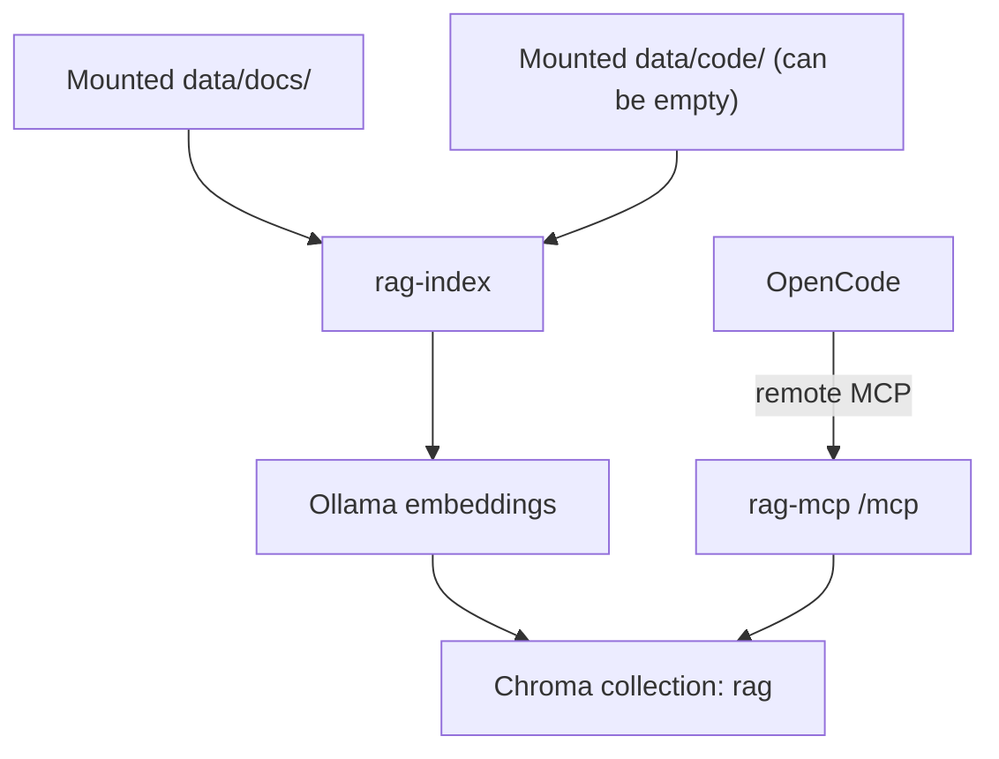

# rag-search-mcp (Go + Chroma + Ollama)

## Overview

`rag-search-mcp` is a Go-based MCP service for semantic retrieval across documentation and code. OpenCode connects through remote MCP (`type: "remote"`), and the runtime stays decoupled from the client. Project knowledge is usually split between docs, source code, and tribal context; keyword search misses intent, and manual navigation is slow during onboarding, debugging, and architecture work. This service indexes docs and code into a shared semantic store and exposes MCP tools to query both with one interface. Embeddings are generated via Ollama, chunks are stored in Chroma, and OpenCode can search by meaning instead of exact terms.

## Architecture



## Installation & Quickstart

```bash
make install
make run
```

`make install` bootstraps local config, prepares runtime data paths, starts the stack, pulls the embedding model, rebuilds the index, and verifies indexed data.

Reindex after changing mounted docs/code:

```bash
make reindex
```

## Example prompts

This repository ships app configuration and skills/tooling so these prompts work directly in OpenCode.

- `Use rag_search with scope docs to explain installation.`
- `Use rag_search with scope code to find chunking logic.`
- `Use rag_search with scope all and summarize architecture from docs and code.`
- `Call rag_list_sources with scope all.`

## Exposed MCP Tools

With the default MCP alias `rag-search-mcp` in `opencode.json`, OpenCode gets:

- `rag_search`: semantic search with `scope=all|docs|code` (default `all`)
- `rag_get_chunk`: fetch one chunk by `chunk_id`
- `rag_list_sources`: list indexed source paths
- `rag_reindex`: rebuild index from mounted sources

Scope behavior:

- `all` searches docs and code
- `docs` searches docs only
- `code` searches code only
- If `data/code` is empty or code ingest is disabled, `all` behaves like docs-only

## Make Targets

| Target | Purpose |
|---|---|
| `make install` | Bootstrap config, start runtime stack, pull model, reindex, verify data |
| `make doctor` | Run quality checks plus index verification |
| `make mod` | Tidy Go modules |
| `make test` | Run Go tests in a container |
| `make test-cover` | Run tests with coverage gate |
| `make build` | Containerized compile check (`go build ./...`) |
| `make run` | Start runtime stack in detached mode |
| `make reindex` | Rebuild semantic index from mounted sources |
| `make compose-up` | Start runtime stack |
| `make compose-down` | Stop runtime stack |
| `make compose-logs` | Stream runtime logs |
| `make compose-validate` | Validate runtime stack configuration |

All Go toolchain commands run in containers through `Makefile` targets, so a local Go installation is not required for normal development flow.

## Configuration

### Environment variables

| Variable | Default | Description |
|---|---|---|
| `RAG_HTTP_HOST` | `127.0.0.1` | HTTP bind address (local default is loopback) |
| `RAG_HTTP_PORT` | `8765` | MCP HTTP port on host |
| `HOST_DOCS_DIR` | `./data/docs` | Host path mounted as docs source |
| `HOST_CODE_DIR` | `./data/code` | Host path mounted as code source (can be empty) |
| `RAG_ENABLE_CODE_INGEST` | `true` | Enable/disable code ingestion |
| `OLLAMA_HOST` | `http://ollama:11434` | Embedding endpoint for containerized runtime |
| `OLLAMA_PORT` | `11434` | Host port mapped to the Ollama container |
| `EMBED_MODEL` | `nomic-embed-text` | Embedding model name |
| `RAG_COLLECTION_NAME` | `rag` | Chroma collection name |
| `RAG_SCOPE_DEFAULT` | `all` | Default search scope |
| `RAG_CHUNK_SIZE` | `1200` | Chunk size in chars |
| `RAG_CHUNK_OVERLAP` | `200` | Chunk overlap in chars |
| `RAG_MAX_TOP_K` | `50` | Upper bound for search `top_k` |

### OpenCode configuration

`opencode.json` uses remote MCP:

```json
{
  "$schema": "https://opencode.ai/config.json",
  "mcp": {
    "rag-search-mcp": {
      "type": "remote",
      "url": "http://127.0.0.1:8765/mcp",
      "enabled": true,
      "timeout": 10000
    }
  }
}
```

Run the runtime however you want (container stack, Kubernetes, VM, localhost binary) as long as the MCP URL is reachable.

Note: `opencode.json` in this repository is local/machine-specific and ignored by git.

## Actions

GitHub Actions workflows:

- `ci-fast`: formatting check, `go vet`, coverage-gated tests, build checks, runtime config validation
- `security-baseline`: gitleaks and `govulncheck`
- `integration-ollama`: full runtime startup via `make install` and reindex smoke check
- `supply-chain`: SBOM generation, license allowlist gate, filesystem/image vulnerability scans

Dependency automation:

- Dependabot updates for `gomod`, `github-actions`, and `docker` via `.github/dependabot.yml`

## Dependencies

Runtime dependencies:

- Docker Engine + Docker Compose plugin
- GNU Make

Service dependencies started by `make` targets:

- `ollama` for embedding generation
- `chroma` for vector storage
- `rag-mcp` for MCP HTTP endpoint

Artifacts and local resources managed during install:

- `.env` is created from `.env.example` if missing
- `opencode.json` is upserted with remote MCP config (default alias: `rag-search-mcp`)
- Host paths are ensured: `data/docs`, `data/code`, `data/index`, `data/models`
- Embedding model `${EMBED_MODEL:-nomic-embed-text}` is pulled into Ollama
