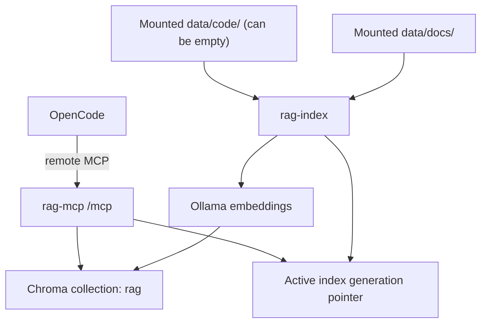

# rag-search-mcp

`rag-search-mcp` is a Docker-first MCP service for semantic retrieval across documentation and source code. It indexes mounted docs and code into a shared vector store and exposes MCP tools for semantic search, chunk lookup, source listing, and reindexing.

The runtime uses:

- Go for the MCP service and indexing logic
- Ollama for embeddings
- Chroma for vector storage
- OpenCode remote MCP for client integration

## Overview

Project knowledge is usually split across docs, code, and local team context. Keyword search misses intent, and manual navigation is slow during onboarding, debugging, and architecture work. `rag-search-mcp` addresses that by providing one semantic retrieval interface across both docs and code.

Key capabilities:

- Semantic retrieval across docs and code through one MCP endpoint
- Scope-aware search with `all`, `docs`, and `code`
- Docker-based runtime with host-mounted source directories
- Persistent host storage for index and embedding models
- Operational `make` targets for install, reindex, diagnostics, and testing

## Architecture



## Requirements

- Docker Engine
- Docker Compose plugin
- GNU Make

No local Go installation is required for the normal development workflow.

## Installation

### Quick start

```bash
make install
```

`make install` performs the standard bootstrap flow:

1. Creates `.env` from `.env.example` if needed
2. Resolves and persists source directory settings
3. Starts the Docker stack
4. Pulls the embedding model into Ollama
5. Rebuilds the semantic index
6. Verifies the indexed data

After changing mounted docs or code, rebuild the index with:

```bash
make reindex
```

### Source directory layout

By default, the service mounts:

- `./data/docs` as the documentation source
- `./data/code` as the code source

An alongside layout is also supported:

```text
<parent>/
  main/
    docs/
    code/
    rag-search-mcp/
```

In that layout, run `make install` from `main/rag-search-mcp` and point the mounts at the sibling directories:

```bash
HOST_DOCS_DIR=../docs HOST_CODE_DIR=../code make install
```

Persistent runtime data stays on the host under `data/` by default, or under the paths set via `HOST_INDEX_DIR` and `HOST_MODELS_DIR`.

### Interactive install behavior

In an interactive terminal, `make install` prompts for source directory selection:

- Keep the current paths
- Use standard paths: `./data/docs` and `./data/code`
- Enter custom paths

Path resolution precedence is:

1. Process environment
2. `.env`
3. Built-in defaults

The selected docs and code paths are written to `.env` before Docker starts.

## Usage

### Exposed MCP tools

With the default MCP alias `rag-search-mcp`, OpenCode can use:

- `rag_search`: semantic search with `scope=all|docs|code`
- `rag_get_chunk`: fetch one chunk by `chunk_id`
- `rag_list_sources`: list indexed source paths
- `rag_reindex`: rebuild the index from mounted sources
- `rag_reindex_status`: inspect the current and last reindex job status

Scope behavior:

- `all`: search docs and code
- `docs`: search docs only
- `code`: search code only
- If `data/code` is empty or code ingest is disabled, `all` effectively behaves as docs-only

### Example prompts

- `Use rag_search with scope docs to explain installation.`
- `Use rag_search with scope code to find chunking logic.`
- `Use rag_search with scope all and summarize architecture from docs and code.`
- `Call rag_list_sources with scope all.`

## Operations

### Make targets

| Target | Purpose |
|---|---|
| `make install` | Bootstrap config, start the stack, pull the model, reindex, verify data |
| `make clean-install` | Reinstall the stack; preserves index and models by default |
| `make up` | Start the runtime stack in detached mode |
| `make down` | Stop the runtime stack without removing containers |
| `make test` | Run Go tests through the Dockerfile `go-runner` stage |
| `make reindex` | Rebuild the semantic index in the running `rag-mcp` container with a progress bar |
| `make logs` | Stream runtime logs |
| `make doctor` | Validate configuration, run runtime diagnostics, reindex, verify index data, and check health |

`make doctor` runs configuration validation first. Configuration `error` findings stop the
doctor run before runtime checks; `warning` findings are printed and runtime checks continue.

`make up` and `make install` use `COMPOSE_UP_FLAGS=auto` by default, which enables
quiet Compose build/pull output when the local Compose version supports it. Set
`COMPOSE_UP_FLAGS=` to see full Compose build output while debugging.

### Reindex consistency

Reindexing uses a single global Chroma collection and an active index generation
pointer. A reindex run writes new or changed source chunks into a new generation
and reuses unchanged source chunks when their fingerprint still matches. Search,
chunk lookup, and source listing continue to read the previous active generation
until the new generation is complete and the pointer is atomically switched.

If reindexing fails before that switch, the previous query state remains active.
Deleted sources are no longer returned after a successful switch because queries
filter by the new active generation. Old generations are cleanup state; query
correctness depends on the active pointer, not on immediate cleanup.

Reindexing also uses a single-writer process lock under the same host-persistent
state directory as the active pointer. CLI reindex runs and MCP-triggered
reindex runs both acquire the non-blocking lock before writing build-generation
records. A second start is rejected instead of queued or used to restart the
running job. CLI duplicate starts exit with code `2`; MCP duplicate starts
return `ok=false`, `status=blocked`, and `error=already_running`.

`make reindex` displays an indeterminate progress bar while the containerized
indexer is running, then prints the `rag-index` output when the run exits.

The `rag_reindex_status` tool returns status JSON with the current `active_job`
when a run is active, the terminal `last_run` record, and the
`last_blocked_start` record for the most recent rejected duplicate start. If a
process exits without writing a terminal status, the next status check marks the
stale active job as failed once the process lock is no longer held.

Lifecycle examples:

```bash
make down
make clean-install
make clean-install FULL_RESET=1
```

`make clean-install FULL_RESET=1` permanently deletes the host directories resolved from `HOST_INDEX_DIR` and `HOST_MODELS_DIR` before reinstalling.

### Observability baseline

`rag-mcp` and `rag-index` write structured runtime logs to stdout. Docker Compose
collects stdout and stderr from all containers, so `make logs` shows the structured
runtime logs together with Chroma and Ollama container output. Chroma and Ollama log
formats are owned by those images and are not normalized by this project.

Runtime logs are JSON by default and use stable event names:

| Event | Meaning |
|---|---|
| `service_start` | `rag-mcp` finished initialization and is listening |
| `tool_call` | MCP tool completed successfully or returned a normal response |
| `tool_error` | MCP tool failed or returned an application-level error |
| `reindex_start` | Reindex started from CLI or MCP |
| `reindex_complete` | Reindex finished with file and chunk counts |
| `reindex_error` | Reindex failed |
| `reindex_blocked` | Reindex start was rejected because another reindex is running |
| `dependency_unhealthy` | `/readyz` found an unhealthy dependency |

Common log fields include `component`, `event`, `tool`, `scope`, `top_k`,
`matches`, `sources`, `files`, `docs_files`, `code_files`, `chunks`,
`duration_ms`, `dependency`, `hint`, `generation`, `changed_files`,
`deleted_files`, `reused_files`, `embedded_chunks`, `reused_chunks`, `job_id`,
`status`, and `active_job_id`. CLI `reindex_start` logs also include
the configured `docs_dir` and `code_dir` source roots so operators can identify
which source configuration a run used. Logs intentionally do not include request
bodies, query text, chunk text, embeddings, or result snippets.

Metrics and health endpoints:

- `/healthz`: liveness only; returns `ok` when the HTTP process can respond
- `/readyz`: readiness; returns JSON dependency status for Chroma and Ollama, and
  uses HTTP `503` when either dependency is unavailable
- `/metrics`: Prometheus text metrics for MCP tool calls, MCP-triggered reindex
  runs, and last observed dependency readiness

Available metrics:

| Metric | Type | Labels |
|---|---|---|
| `rag_mcp_tool_calls_total` | counter | `tool`, `status` |
| `rag_mcp_reindex_runs_total` | counter | `trigger`, `status` |
| `rag_mcp_readiness_dependency_up` | gauge | `dependency` |

CLI and shell commands keep their automation-friendly stream semantics: normal
reports go to stdout, and command errors go to stderr. The structured runtime log
baseline applies to `rag-mcp` and `rag-index`.

## Configuration

### Security boundary for v1

- Default mode is `localhost-only`
- `LAN-only` is explicit opt-in and not enabled by default
- WAN/Internet exposure is out of scope in v1
- VPN/overlay access is out of scope in v1

Non-loopback access requires additional controls as defined in the ADR and threat model.
To opt into LAN-only operation, set `RAG_HTTP_HOST` to an approved LAN interface
address and constrain access with the host firewall or local network controls. Avoid
using `0.0.0.0` unless all host interfaces are intentionally inside the approved LAN
boundary.

### Environment variables

| Variable | Default | Description |
|---|---|---|
| `RAG_HTTP_HOST` | `127.0.0.1` | Host interface used by Docker to publish the MCP HTTP port; set to an approved LAN address for explicit LAN-only opt-in |
| `RAG_HTTP_PORT` | `8765` | MCP HTTP port published on the host |
| `HOST_DOCS_DIR` | `./data/docs` | Host path mounted as docs source |
| `HOST_CODE_DIR` | `./data/code` | Host path mounted as code source |
| `HOST_INDEX_DIR` | `./data/index` | Host path used for Chroma persistence |
| `HOST_MODELS_DIR` | `./data/models` | Host path used for Ollama model persistence |
| `RAG_ENABLE_CODE_INGEST` | `true` | Enable or disable code ingestion |
| `RAG_CHROMA_TENANT` | `default_tenant` | Chroma tenant |
| `RAG_CHROMA_DATABASE` | `default_database` | Chroma database |
| `RAG_COLLECTION_NAME` | `rag` | Chroma collection name |
| `RAG_INDEX_STATE_DIR` | `./data/index-state` | Internal active-generation pointer directory; Docker maps it under `HOST_INDEX_DIR/rag-state` |
| `RAG_SCOPE_DEFAULT` | `all` | Default search scope |
| `RAG_CHUNK_SIZE` | `1200` | Chunk size in characters |
| `RAG_CHUNK_OVERLAP` | `200` | Chunk overlap in characters |
| `RAG_MAX_TOP_K` | `50` | Upper bound for search `top_k` |
| `RAG_LOG_LEVEL` | `info` | Runtime log level: `debug`, `info`, `warn`, or `error` |
| `RAG_LOG_FORMAT` | `json` | Runtime log format for `rag-mcp` and `rag-index`: `json` or `text` |
| `OLLAMA_HOST` | `http://ollama:11434` | Embedding endpoint used by `rag-mcp` |
| `OLLAMA_PORT` | `11434` | Host port mapped to the Ollama container |
| `EMBED_MODEL` | `nomic-embed-text` | Embedding model name |

### OpenCode configuration

`opencode.json` uses remote MCP:

```json
{
  "$schema": "https://opencode.ai/config.json",
  "mcp": {
    "rag-search-mcp": {
      "type": "remote",
      "url": "http://127.0.0.1:8765/mcp",
      "enabled": true,
      "timeout": 10000
    }
  }
}
```

The project is intended to be operated through the provided Docker stack and `make` targets.

Local `opencode.json` variants are ignored by Git.

### Configuration diagnostics

The internal config doctor validates `.env`, `opencode.json`, host mount paths, ports,
runtime tuning values, and localhost-first security defaults. It is exposed through
`make doctor` and `make install`, not as a separate public Make target.

Finding severity:

- `error`: invalid or unsafe configuration that stops the current workflow
- `warning`: configuration drift or missing setup that should be reviewed, while the workflow may continue

The internal shell entry point is available for maintainer automation:

```bash
sh ./shell/config-doctor.sh
```

## Development

This repository uses a Docker-first workflow.

- Use `make` targets as the primary local interface for runtime and development workflows
- Avoid direct local `go` execution in standard workflows
- Use `make test` for Go tests
- Treat shell helpers under `shell/` as internal implementation details, except documented CI and maintainer gates

The Dockerfile is the canonical source for the shared Go toolchain image used in local workflows and CI.

Project automation must execute Go tooling through the Dockerfile `go-runner` stage. Host-side Go project checks are unsupported because they can use a different toolchain, module cache, or dependency graph than CI. To verify this rule locally, run:

```bash
sh ./shell/ci-container-only-go.sh
```

Module file drift is checked with the same containerized toolchain used by CI:

```bash
sh ./shell/ci-mod-tidy-check.sh
```

CI and maintainer gates are intentionally exposed as shell commands instead of Make targets:

```bash
sh ./shell/ci-govulncheck.sh
sh ./shell/ci-mod-tidy-check.sh
sh ./shell/ci-golden-queries.sh
sh ./shell/ci-toolchain-security.sh
sh ./shell/ci-container-supply-chain-policy.sh
sh ./shell/ci-container-supply-chain-policy-smoke.sh
```

## CI and automation

GitHub Actions workflows:

- `ci-fast`: `container-only-go`, `fmt`, `mod-tidy`, `vet`, `test`, `golden-queries`, `build`, `bootstrap-smoke`, `compose-validate`, plus non-required `docker-test-stage`
- `security-baseline`: `gitleaks`, runtime `govulncheck`, and `toolchain-security`
- `dependency-review`: PR dependency diff review for new high or critical vulnerability findings
- `integration-ollama`: full runtime startup via `make install` with health smoke checks
- `supply-chain`: container policy guard, SBOM generation, license allowlist gate, and filesystem/image vulnerability scans

Recommended required checks for branch protection:

Required merge gates and stable check names are documented in `docs/ci-required-checks.md`.
Container supply-chain policy, base-image pinning, and no-exception vulnerability gate rules are documented in `docs/container-supply-chain-security.md`.

### Golden query updates

Deterministic retrieval regression coverage lives under `internal/rag/testdata/golden/`.
The golden suite uses small docs and code fixtures, `queries.json`, a fresh
fixture index, fixed chunking and top-k settings, and a controlled
`golden-keyword-v1` embedding model inside the Go test path.

Run the same gate locally and in CI with:

```bash
sh ./shell/ci-golden-queries.sh
```

When retrieval behavior changes intentionally, update the relevant fixture or
`queries.json` expectation in the same pull request, include the reason in the
review notes, and keep the generated failure report reviewable by preserving the
query name, expected source, actual ranked sources, and snippets.

Dependabot updates are configured for:

- Go modules
- GitHub Actions
- Docker

### CI toolchain governance

Delivery and security tooling is versioned separately from product runtime dependencies:

- Go-based CI tools are pinned in the separate `tools` Go module. Update them with the normal Go module workflow in `tools/`; Dependabot tracks that module independently from the product module.
- Toolchain dependency security is checked separately from runtime reachability: `sh ./shell/ci-govulncheck.sh` runs the runtime vulnerability scan, and `sh ./shell/ci-toolchain-security.sh` verifies the `tools` module graph against known forbidden legacy modules and minimum patched dependency versions.
- Anchore binaries used by `supply-chain` are pinned in `shell/ci-tool-versions.env` and installed by `shell/install-anchore-tools.sh`.
- External binary downloads are verified against the upstream release checksum files before installation.
- Filesystem and image vulnerability scans cover product/runtime artifacts, block high and critical findings even when no fix is available, and do not allow local vulnerability exceptions.
- Dockerfile base images are pinned by digest. Update the readable tag and digest together, then rerun the container policy and scan gates.
- The separate `tools` module is governed through its own module metadata and Dependabot updates.

The CI shell scripts and workflow YAML consume those canonical sources instead of carrying their own tool versions.

## Troubleshooting

### The index does not reflect recent file changes

Rebuild it:

```bash
make reindex
```

The architecture decision for incompatible index, ingestion, and query changes is also reindex-first: old index artifacts do not require a migration path when they can be rebuilt from mounted sources. See `docs/architecture/RAG-SEARCH-MCP-ADR-2026-05-31-reindex-first-schema-evolution.md`.

The current reindex implementation keeps one global Chroma collection and
switches an active generation pointer instead of rotating collections. Existing
indexes created before this generation metadata existed require one fresh
`make reindex`. See `docs/architecture/RAG-SEARCH-MCP-ADR-2026-06-04-atomic-generation-switch.md`.

### `make reindex` reports that another reindex is running

Only one reindex writer is allowed at a time. Use the `rag_reindex_status` MCP
tool to inspect the active job. If `active_job` is present, wait for that job to
finish. The rejected start is recorded as `last_blocked_start`. Do not delete
lock files manually while a legitimate reindex process is still running.

### `make doctor` or `make reindex` says the stack is not running

Start the runtime first:

```bash
make up
```

For a full bootstrap, use:

```bash
make install
```

### `make doctor` reports configuration findings

Fix `error` findings first; they stop the doctor run before runtime checks. Review
`warning` findings such as stale `opencode.json` ports or missing optional paths, then
rerun `make doctor`.

### `/readyz` reports Chroma or Ollama as unhealthy

Check the `dependency` and `hint` fields in the `dependency_unhealthy` log event.
For Chroma issues, verify the `chroma` container, `RAG_CHROMA_*` settings, and
index persistence path. For Ollama issues, verify the `ollama` container,
`OLLAMA_HOST`, and whether the embedding model has been pulled.

Run the full diagnostic path after fixing dependencies:

```bash
make doctor
```

### I need to reset persisted runtime data

Use:

```bash
make clean-install FULL_RESET=1
```

This deletes the resolved host paths for index and model persistence before reinstalling.
The paths may point to new locations; `clean-install` creates missing parent directories while resolving them, then removes only the resolved `HOST_INDEX_DIR` and `HOST_MODELS_DIR` targets.
Unsafe broad paths such as `/`, the repository root or parent, and `HOME` are refused.

### Can I expose the service beyond localhost?

Not by default. v1 is localhost-first. For explicit LAN-only opt-in, set
`RAG_HTTP_HOST` to an approved LAN interface address, review firewall or local
network controls, and keep WAN/VPN/public exposure out of scope unless a new ADR and
threat model cover that operating mode.
