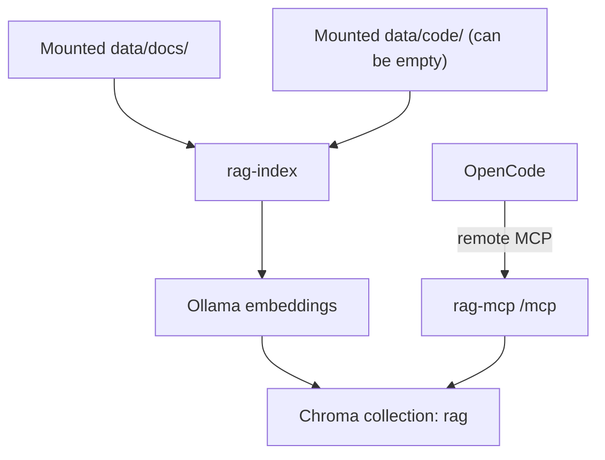

# rag-search-mcp

`rag-search-mcp` is a Docker-first MCP service for semantic retrieval across documentation and source code. It indexes mounted docs and code into a shared vector store and exposes MCP tools for semantic search, chunk lookup, source listing, and reindexing.

The runtime uses:

- Go for the MCP service and indexing logic
- Ollama for embeddings
- Chroma for vector storage
- OpenCode remote MCP for client integration

## Overview

Project knowledge is usually split across docs, code, and local team context. Keyword search misses intent, and manual navigation is slow during onboarding, debugging, and architecture work. `rag-search-mcp` addresses that by providing one semantic retrieval interface across both docs and code.

Key capabilities:

- Semantic retrieval across docs and code through one MCP endpoint
- Scope-aware search with `all`, `docs`, and `code`
- Docker-based runtime with host-mounted source directories
- Persistent host storage for index and embedding models
- Operational `make` targets for install, reindex, diagnostics, and testing

## Architecture



## Requirements

- Docker Engine
- Docker Compose plugin
- GNU Make

No local Go installation is required for the normal development workflow.

## Installation

### Quick start

```bash
make install
```

`make install` performs the standard bootstrap flow:

1. Creates `.env` from `.env.example` if needed
2. Resolves and persists source directory settings
3. Starts the Docker stack
4. Pulls the embedding model into Ollama
5. Rebuilds the semantic index
6. Verifies the indexed data

After changing mounted docs or code, rebuild the index with:

```bash
make reindex
```

### Source directory layout

By default, the service mounts:

- `./data/docs` as the documentation source
- `./data/code` as the code source

An alongside layout is also supported:

```text
<parent>/
  main/
    docs/
    code/
    rag-search-mcp/
```

In that layout, run `make install` from `main/rag-search-mcp` and point the mounts at the sibling directories:

```bash
HOST_DOCS_DIR=../docs HOST_CODE_DIR=../code make install
```

Persistent runtime data stays on the host under `data/` by default, or under the paths set via `HOST_INDEX_DIR` and `HOST_MODELS_DIR`.

### Interactive install behavior

In an interactive terminal, `make install` prompts for source directory selection:

- Keep the current paths
- Use standard paths: `./data/docs` and `./data/code`
- Enter custom paths

Path resolution precedence is:

1. Process environment
2. `.env`
3. Built-in defaults

The selected docs and code paths are written to `.env` before Docker starts.

## Usage

### Exposed MCP tools

With the default MCP alias `rag-search-mcp`, OpenCode can use:

- `rag_search`: semantic search with `scope=all|docs|code`
- `rag_get_chunk`: fetch one chunk by `chunk_id`
- `rag_list_sources`: list indexed source paths
- `rag_reindex`: rebuild the index from mounted sources

Scope behavior:

- `all`: search docs and code
- `docs`: search docs only
- `code`: search code only
- If `data/code` is empty or code ingest is disabled, `all` effectively behaves as docs-only

### Example prompts

- `Use rag_search with scope docs to explain installation.`
- `Use rag_search with scope code to find chunking logic.`
- `Use rag_search with scope all and summarize architecture from docs and code.`
- `Call rag_list_sources with scope all.`

## Operations

### Make targets

| Target | Purpose |
|---|---|
| `make install` | Bootstrap config, start the stack, pull the model, reindex, verify data |
| `make clean-install` | Reinstall the stack; preserves index and models by default |
| `make up` | Start the runtime stack in detached mode |
| `make down` | Stop the runtime stack without removing containers |
| `make test` | Run Go tests through the Dockerfile `go-runner` stage |
| `make reindex` | Rebuild the semantic index in the running `rag-mcp` container |
| `make logs` | Stream runtime logs |
| `make doctor` | Run runtime diagnostics, reindex, verify index data, and check health |

Lifecycle examples:

```bash
make down
make clean-install
make clean-install FULL_RESET=1
```

`make clean-install FULL_RESET=1` permanently deletes the host directories resolved from `HOST_INDEX_DIR` and `HOST_MODELS_DIR` before reinstalling.

## Configuration

### Security boundary for v1

- Default mode is `localhost-only`
- `LAN-only` is explicit opt-in and not enabled by default
- WAN/Internet exposure is out of scope in v1
- VPN/overlay access is out of scope in v1

Non-loopback access requires additional controls as defined in the ADR and threat model.

### Environment variables

| Variable | Default | Description |
|---|---|---|
| `RAG_HTTP_PORT` | `8765` | MCP HTTP port published on the host |
| `HOST_DOCS_DIR` | `./data/docs` | Host path mounted as docs source |
| `HOST_CODE_DIR` | `./data/code` | Host path mounted as code source |
| `HOST_INDEX_DIR` | `./data/index` | Host path used for Chroma persistence |
| `HOST_MODELS_DIR` | `./data/models` | Host path used for Ollama model persistence |
| `RAG_ENABLE_CODE_INGEST` | `true` | Enable or disable code ingestion |
| `RAG_CHROMA_TENANT` | `default_tenant` | Chroma tenant |
| `RAG_CHROMA_DATABASE` | `default_database` | Chroma database |
| `RAG_COLLECTION_NAME` | `rag` | Chroma collection name |
| `RAG_SCOPE_DEFAULT` | `all` | Default search scope |
| `RAG_CHUNK_SIZE` | `1200` | Chunk size in characters |
| `RAG_CHUNK_OVERLAP` | `200` | Chunk overlap in characters |
| `RAG_MAX_TOP_K` | `50` | Upper bound for search `top_k` |
| `OLLAMA_HOST` | `http://ollama:11434` | Embedding endpoint used by `rag-mcp` |
| `OLLAMA_PORT` | `11434` | Host port mapped to the Ollama container |
| `EMBED_MODEL` | `nomic-embed-text` | Embedding model name |

### OpenCode configuration

`opencode.json` uses remote MCP:

```json
{
  "$schema": "https://opencode.ai/config.json",
  "mcp": {
    "rag-search-mcp": {
      "type": "remote",
      "url": "http://127.0.0.1:8765/mcp",
      "enabled": true,
      "timeout": 10000
    }
  }
}
```

The project is intended to be operated through the provided Docker stack and `make` targets.

Local `opencode.json` variants are ignored by Git.

## Development

This repository uses a Docker-first workflow.

- Use `make` targets as the primary local interface
- Avoid direct local `go` execution in standard workflows
- Use `make test` for Go tests
- Treat shell helpers under `shell/` as internal implementation details behind the `make` targets

The Dockerfile is the canonical source for the shared Go toolchain image used in local workflows and CI.

## CI and automation

GitHub Actions workflows:

- `ci-fast`: `fmt`, `vet`, `test`, `build`, `bootstrap-smoke`, `compose-validate`, plus non-required `docker-test-stage`
- `security-baseline`: `gitleaks` and `govulncheck`
- `integration-ollama`: full runtime startup via `make install` with health smoke checks
- `supply-chain`: SBOM generation, license allowlist gate, and filesystem/image vulnerability scans

Recommended required checks for branch protection:

- `fmt`
- `vet`
- `test`
- `build`
- `bootstrap-smoke`
- `compose-validate`

Dependabot updates are configured for:

- Go modules
- GitHub Actions
- Docker

## Troubleshooting

### The index does not reflect recent file changes

Rebuild it:

```bash
make reindex
```

### `make doctor` or `make reindex` says the stack is not running

Start the runtime first:

```bash
make up
```

For a full bootstrap, use:

```bash
make install
```

### I need to reset persisted runtime data

Use:

```bash
make clean-install FULL_RESET=1
```

This deletes the resolved host paths for index and model persistence before reinstalling.

### Can I expose the service beyond localhost?

Not by default. v1 is localhost-first. Non-loopback access is an explicit opt-in topic with additional controls and documented constraints in the ADR and threat model.
