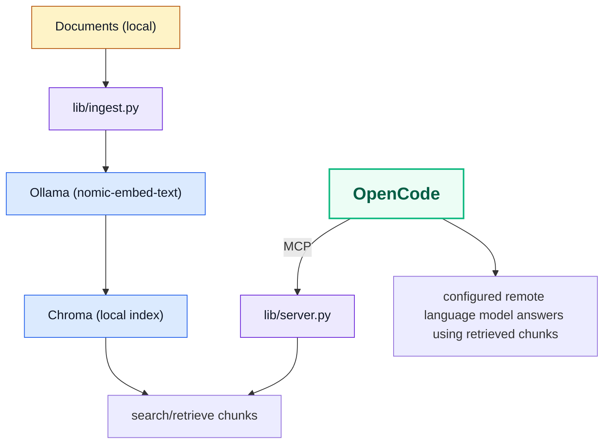

# Local RAG with MCP for OpenCode

Local RAG for OpenCode via MCP (Model Context Protocol). Documents, embeddings,
and the Chroma index stay local; only retrieved chunks are sent to the
configured remote language model for answer generation.

System dependencies are installed through Homebrew (macOS) or Linux package
managers (for example `apt`/`dnf`), while Python dependencies are locked and
synced with `uv`.

## Architecture



## Quick Start

The installer handles dependency setup per platform: Homebrew on macOS and
Linux package/bootstrap tooling on Linux (for example `apt`/`dnf` plus vendor
install scripts).

```bash
# Install everything (uv, ollama, locked Python deps, project-local opencode.json)
make install

# If no .env exists yet, the installer creates one from lib/.env.example.
# Update it if you want custom docs/index paths, model, or Ollama host.

# Add your documents to the configured docs directory (defaults to docs/)
# A sample doc is already included.

# Build the vector index safely
make reindex

# Verify the actual OpenCode/MCP workflow
make doctor
```

Dependency maintenance:

```bash
# Apply locked versions from uv.lock (no upgrades)
make update

# Upgrade all dependencies and refresh uv.lock
make upgrade

# Upgrade one dependency and refresh uv.lock
make upgrade-package PACKAGE=chromadb

# After upgrades, verify setup
make doctor
```

If you changed `EMBED_MODEL` or `make doctor` reports an index/model mismatch,
run `make reindex` to align embeddings with your current model configuration.

## OpenCode Skill

This repository includes a project-local OpenCode skill for the MCP-backed
local RAG workflow:

- Skill path: `.opencode/skills/local-rag-mcp/SKILL.md`
- Purpose: guide OpenCode to use the local MCP tools before answering questions
  from indexed documents
- Use it for questions about files in your configured docs directory, semantic search, and chunk lookup

## How It Works

### Ingestion (`lib/ingest.py`)

- Reads `.md`, `.txt`, and `.pdf` files from `RAG_DOCS_DIR`
- Splits content into overlapping chunks
- Generates embeddings via the configured Ollama endpoint and embedding model
- Builds a fresh Chroma index in a temporary directory and swaps it into place only after success

### MCP Server (`lib/server.py`)

Exposes three tools to OpenCode:

| Tool | Description |
|------|-------------|
| `local_rag_search_docs` | Semantic search over indexed documents |
| `local_rag_get_chunk` | Retrieve a specific chunk by ID |
| `local_rag_list_sources` | List all indexed source files |

### OpenCode Integration

The installer writes or updates the `local_rag` MCP block inside
`opencode.json` using the current repo path and resolved environment settings.
This file is machine-specific and should not be committed. OpenCode
automatically picks up this project-local config when started in the repo
directory. It merges with your global `~/.config/opencode/opencode.json`;
unrelated keys are preserved and the project-local `local_rag` block is kept in
sync with the current checkout.

The repository also ships a project-local skill at
`.opencode/skills/local-rag-mcp/SKILL.md` so OpenCode has explicit guidance for
using the local MCP tools exposed by `lib/server.py`.

## Expected Workflow

1. Run `make install`.
2. Review `.env` if you want to change document path, index path, Ollama host, model, or chunking.
3. Add documents to `RAG_DOCS_DIR`.
4. Run `make reindex` to build a new index without deleting the previous one first.
   Re-run `make reindex` whenever you change `EMBED_MODEL`.
5. Run `make doctor` to verify binaries, dependencies, config alignment, indexed data, and MCP startup.
6. Start OpenCode in this repo and use the `local_rag_*` tools or the `local-rag-mcp` skill.

## Adding Documents

1. Place files in `RAG_DOCS_DIR` (`.md`, `.txt`, `.pdf`; defaults to `docs/`)
2. Run `make reindex`

## Testing in OpenCode

Try these prompts:

- `Use local_rag_list_sources to show available sources.`
- `Use local_rag_search_docs to explain this setup.`
- `Use local_rag_search_docs with source_filter set to rag-test.md.`
- `Search my local docs for <your topic>.`
- `Use the local-rag-mcp skill to search the indexed docs before answering.`

## Quality Checks

Run local quality gates before creating a PR:

```bash
uv sync --group dev
uv run ruff check lib tests
uv run mypy
uv run pytest -q
```

The fast CI workflow executes these checks on every push and pull request.

## Troubleshooting

- `make doctor` fails with model/index mismatch: run `make reindex` after confirming `EMBED_MODEL` and the Ollama model availability.
- `local_rag_search_docs` returns embedding errors: verify Ollama API availability at `OLLAMA_HOST` and that the embedding model exists (`ollama pull <model>`).
- No matches from a source filter: use `local_rag_list_sources` first and pass a substring from the indexed `source_path`.

## Configuration

All settings have sensible defaults. Override them in `.env` or via exported
environment variables. If `.env` is missing, `make install` creates it from
`lib/.env.example`.

All scripts load the same config before they run, and `make install` writes the
same resolved values into `opencode.json`, so install, reindex, doctor, and
OpenCode use one consistent workflow.

| Variable | Default | Description |
|----------|---------|-------------|
| `RAG_DOCS_DIR` | `docs` | Document source directory |
| `RAG_CHROMA_DIR` | `index` | Chroma vector index directory |
| `OLLAMA_HOST` | `http://127.0.0.1:11434` | Ollama API endpoint |
| `EMBED_MODEL` | `nomic-embed-text` | Embedding model (pin a tag/version for stable results) |
| `COLLECTION_NAME` | `docs` | Chroma collection name |
| `RAG_CHUNK_SIZE` | `1200` | Chunk size in characters |
| `RAG_CHUNK_OVERLAP` | `200` | Overlap between chunks |

When `EMBED_MODEL` changes, the existing index remains usable. The server reads the
index metadata and automatically uses the index model for query embeddings if there
is a mismatch, then returns a reindex recommendation in search responses.

If the index model is unavailable in Ollama, retrieval fails with a clear error and
you should run `make reindex` after making the target model available.

See `lib/.env.example` for the documented template.

Relative paths are resolved from the repository root. Absolute paths also work.

## Make Targets

The project provides a portable `Makefile` for macOS and Linux. It wraps the
underlying scripts so setup and maintenance can be run consistently through
`make` targets.

| Target | Purpose |
|--------|---------|
| `make help` | Show available targets |
| `make install` | Run the installer |
| `make setup` | Alias for `make install` |
| `make install-help` | Show installer options |
| `make install-dry-run` | Preview installer actions |
| `make install-yes` | Run installer without prompts |
| `make install-no-ollama` | Skip ollama install/start/model pull |
| `make install-no-config` | Skip `opencode.json` generation |
| `make update` | Sync local Python dependencies from `uv.lock` |
| `make upgrade` | Upgrade all Python dependencies and refresh `uv.lock` |
| `make upgrade-package PACKAGE=<name>` | Upgrade one dependency and refresh `uv.lock` |
| `make reindex` | Re-index documents using the shared config |
| `make doctor` | Run health checks plus MCP smoke tests |

Example with installer flags:

```bash
make install INSTALL_ARGS="--yes --skip-ollama"
```

## Install Options

```
make install INSTALL_ARGS="[OPTIONS]"

make install-help

  --dry-run       Show what would be done without executing
  --yes, -y       Skip all confirmation prompts
  --skip-ollama   Skip ollama installation, service start, and model pull
  --skip-config   Skip opencode.json generation
  -h, --help      Show this help message
```

## Project Structure

```
./
  lib/
    install.sh                # Main installer/orchestrator
    common.sh                 # Shared installer helpers
    bootstrap.sh              # Dependency/bootstrap module
    config.sh                 # Project config generation module
    .env.example              # Environment variable documentation
    ingest.py                 # Document ingestion pipeline
    server.py                 # MCP server (search/get_chunk/list_sources)
    reindex.sh                # Re-index convenience script
    doctor.sh                 # Health check script
  docs/                       # Your documents go here
  index/                      # Chroma vector index (generated; contents ignored)
  opencode.json               # Generated locally at install time (not committed)
```

## Requirements

- macOS or Linux
- Homebrew on macOS, or a Linux package manager (for example `apt`/`dnf`) for system dependencies
- `curl` available for installer/bootstrap steps
- OpenCode with a configured model provider
- Internet connection (for initial dependency installation and model download)
